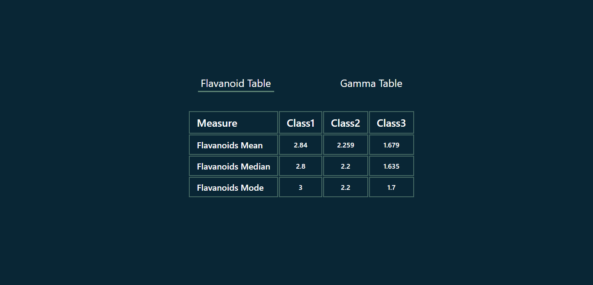
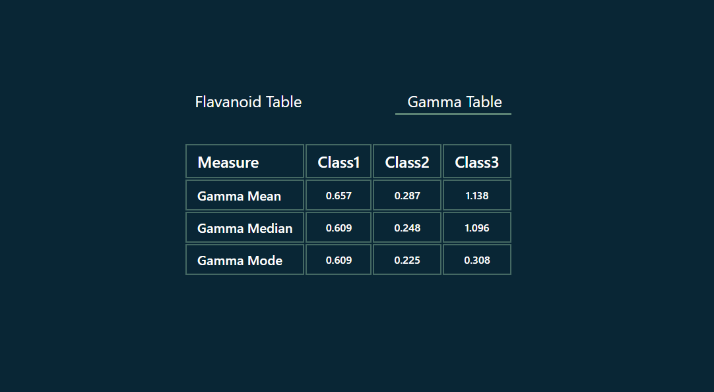

# Getting Started with Create React App

This project was created with [Create React App](https://github.com/facebook/create-react-app).

If you want to directly checkout the result, you can try this link [https://data-visualization-task.netlify.app/](https://data-visualization-task.netlify.app/)

To start the project, in the base directory of the project folder,

run the following commands

### `yarn install`
this command will install all the node modules needed for the working of the project after successfull execution of the above command, 

### `yarn start`
This command will run the application in the development mode.
It will open [http://localhost:3000](http://localhost:3000) in the browser or you can also open it manually to view the results

Result of Flavanoid Table

Result of Gamma Table

you can also try 

### `yarn build`

this command builds the app for production to the `build` folder.\
It correctly bundles React in production mode and optimizes the build for the best performance.

The build is minified and the filenames include the hashes.\
Your app is ready to be deployed!

See the section about [deployment](https://facebook.github.io/create-react-app/docs/deployment) for more information.

### `yarn eject`

**Note: this is a one-way operation. Once you `eject`, you can’t go back!**

If you aren’t satisfied with the build tool and configuration choices, you can `eject` at any time. This command will remove the single build dependency from your project.

Instead, it will copy all the configuration files and the transitive dependencies (webpack, Babel, ESLint, etc) right into your project so you have full control over them. All of the commands except `eject` will still work, but they will point to the copied scripts so you can tweak them. At this point you’re on your own.

You don’t have to ever use `eject`. The curated feature set is suitable for small and middle deployments, and you shouldn’t feel obligated to use this feature. However we understand that this tool wouldn’t be useful if you couldn’t customize it when you are ready for it.
 
